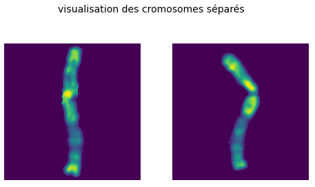
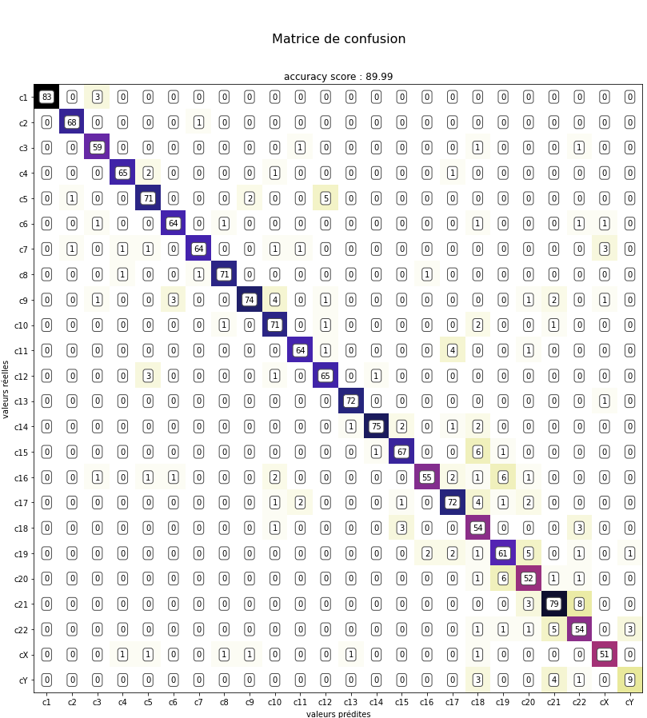
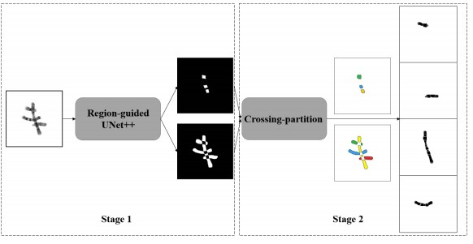
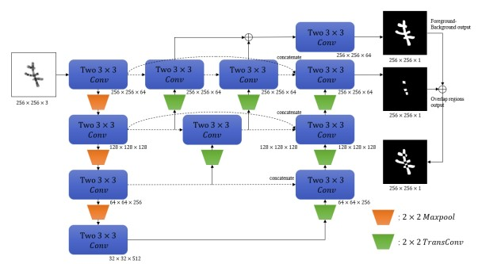
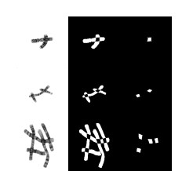

# P35_Traitement_Caryotypes

## Introduction

### Enjeux de la reconnaissance des chromosomes

A l’heure actuelle, les cancers du sang, hémopathies malignes, représentent 30% des cancers de l’enfant et 5% des cancers chez l’adulte. Afin de pouvoir classifier ces cancers, il est nécessaire de prendre en compte le tissu d’origine, la morphologie, les marqueurs protéiques, ainsi que les données chromosomiques de ces cancers. Les cancers du sang sont diagnostiqués grâce au caryotype, car ils sont dus à une translocation de gènes, dans laquelle les chromosomes 9 et 22 ont échangé réciproquement des fragments de chromosomes.

Pour pouvoir mettre en évidence ce type d’anomalie chromosomique, il est donc nécessaire de classer les chromosomes afin d’établir le caryotype, puis de l’analyser. Ce projet est composé de deux parties, la première se charge de la segmentation et de la classification (Part I), et la deuxième se consacre à la détection d’anomalies (Part II). Dans ce brief, on va traiter la première partie.

Un caryotype est réalisé à partir d’une photographie d’une cellule en vue microscopique lors de la métaphase de la mitose. A cette étape, la chromatine est condensée ce qui rend les chromosomes visibles. Dans un caryotype, les chromosomes sont classés par paire, par taille et en fonction de la position du centromère. Il y a 23 paires de chromosomes autosomes (de 1 à 22) et une paire de gonosomes (XX pour les femmes et XY pour les hommes).

Les logiciels de réalisation des caryotypes actuels sont semi-automatiques et nécessitent encore l’intervention des techniciens de laboratoire qui savent reconnaître les chromosomes. 
**L'objectif de ce projet est d'automatiser entièrement ce processus**. Pour ce faire, il est nécessaire de procéder en deux étapes. Il s'agit d'abord d'isoler chacun des chromosomes présents dans les vues microscopiques des cellules en phase de mitose (que nous appellerons "mélange"), puis de les classifier, afin d'établir le caryotype final.

### Données disponibles

203 couples d'images mélange/caryotype on été mise à disposition par le CHRU pour la réalisation de ce projet

## Classification des images des chromosomes

Le travail de classification se fait en utilisant uniquement les caryotypes.

En premier lieu, un travail est réalisé pour extraire des images de chromosomes de chacun des 203 caryotypes. On obtient donc environ 23 x 203 = 4669 images de chromosomes (plus ou moins, en fonction des anomalies qui ont pu êtres rencontrées : trisomies, monosomies, ...). 
Les images obtenues, extraites et enregistrées accompagnées de leur label (leur n° chromosomique), permettront d'entrainer un modèle de classification.  Ce images sont similaires à celles visibles ci-dessous :

Le code pour obtenir les images et leur label est décrit dans le notebook [chomosomes_extraction.ipynb](chomosomes_extraction.ipynb)

Grâce à ces images on peut ensuite entraîner un modèle de classification efficace. 

Une data-augmentation a été réalisée pour donner une rotation aléatoire à chaque image, 
les chromosomes détectés dans les mélanges n'étant pas dirigés tous dans le même sens. 
Un modèle séquentiel de CNN convolutif est ensuite entraîné sur les images. 

Les résultats en sortie du modèle sont plutôt bons, avec une accuracy finale de 90% sur la base de test.

## Segmentation des images des chromosomes

Différentes approches ont été testées pour la segmentation des vues microscopiques des cellules en phase de mitose ("mélanges"). 

Le défi dans cette segmentation est de séparer les chromosomes qui présentent un chevauchement. Pour les chromosomes isolés, une segmentation avec des outils simples comme les méthodes déjà implémentées dans scikit-image conviennent (voir [Label Image Regions](https://scikit-image.org/docs/dev/auto_examples/segmentation/plot_label.html#sphx-glr-auto-examples-segmentation-plot-label-py)).

Nous avons d'abord tenté une segmentation sémantique multiclasse en créant nos propres chevauchements de chromosomes avec leurs masques de segmentation. Malheureusement, ces mélanges créés de toutes pièces ne ressemblaient pas assez aux mélanges réels, et les résultats sur les mélanges réels n'étaient pas bons.

Nous avons ensuite essayé une segmentation par instance avec pytorch et détectron, en labellisant manuellement les mélanges réels existants. Les résultats, légèrements meilleurs que les précédents, n'étaient pas non plus convaincants.

Finalement, la solution résidait dans l'article scientifique de Cao X et Al, _ChromSeg: Two-Stage Framework for Overlapping
Chromosome Segmentation and Reconstruction_ .

Lien vers l'article : http://www.bio8.cs.hku.hk/pdf/chromseg.pdf  
LIen vers le github : https://github.com/HKU-BAL/ChromSeg

Cette équipe de recherche est parvenue à segmenter les chevauchements de chromosomes en utilisant un réseau UNet++, qui extrait séparément les croisements et chacun des chromosomes.

Leurs approche est composé de deux partie : 
* La première, qui est le modèle
* et la seconde, qui est le script pour obtenir les chromosomes

Le schéma générale de la solution :

Et plus en détail, le schéma Unet++ utilisé :

Il s'agit d'un réseau de segmentation sémantique pour séparer les régions de chevauchement et de non-chevauchement des images d'entrée. L'idée de l'UNet++ guidé par région a été inspiré par UNet++, qui est un neurone convolutif réseau pour la segmentation d'images qui ajoute des modules d'agrégation densément sur la connexion de saut de son prédécesseur U-Net pour fusionner mieux les informations. 
Dans cet UNet++ guidé par région, nous avons étendu UNet++ pour qu'il devienne un prédicteur de région multibranche. L'entrée de l'UNet++ guidé par région est une image 256 × 256 RVB à 3 canaux. Nous avons utilisé un U-Net peu profond comme encodeur-décodeur et ajouté trois couches de convolution médianes au chemin de connexion de saut.

Le modèle a été entraîné avec 345 images en 256 x 256 toutes annoté avec deux images binaires représentant les régions de chevauchement et les régions de non-chevauchement.

Un exemple :

Pour utiliser ce modèle il faut au préalable installé `pytroch` ou utiliser un `Google Colab` (qui possède déjà pytorch), __pour l’utilisation avec colab__ il faudra modifier la partie `argparse.ArgumentParser()` et __dans tous les cas__ supprimer la partie `ContourAttention()` dans le fichier `Unet_plus.py`.

Une fois tout cela fait, il ne restera plus qu'à fournir une __image en 256 x 256__ au modèle pour qu’il retourne un masque,les régions de chevauchement et les régions de non-chevauchement.
Ensuite, une fois en possession de toutes les images, il suffit de donner l’image de base, le masque, et les régions de chevauchement au deuxième script pour qu'il sépare les chromosomes.

